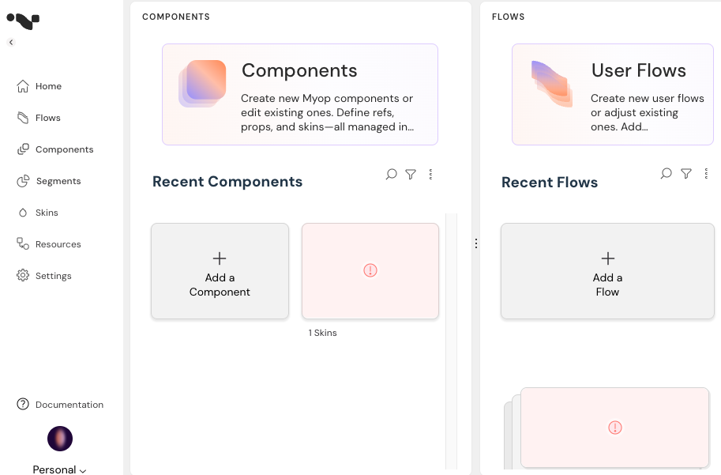

# Myop React Integration Guide

## Overview

This guide explains how to integrate your React components with Myop, allowing you to expose them as web components and incorporate them into Myop flows.

## Table of Contents

- [Exposing React Components](#exposing-react-components)
- [Creating Myop WebComponents](#creating-myop-webcomponents)
- [Creating Flows](#creating-flows)
- [Using Myop Components in React](#using-myop-components-in-react)
- [Communication with React Components](#communication-with-react-components)

## Exposing React Components

There are two ways to expose your React components to Myop:

### Direct Exposure

Use the `expose` function to directly expose your React component:

```typescript
import { App } from './app';
import { expose } from '@myop/react-remote';

expose(App, 'test-comp-1');
```

## Creating Myop WebComponents

Follow these steps to create a Myop WebComponent from your react component:

1. Open the Myop dashboard at [https://dashboard.myop.dev/](https://dashboard.myop.dev/) <br>
   <br>

2. Navigate to the Component Editor screen and click on **"+ Add a Component"** button <br>
   <br>

3. In the Component Editor, click on **"+ Add"** button

4. Configure your component:

   - Change the loader to "WebComponent"
   - Enter your component URL (e.g., http://localhost:4400/main.js)
   - Enter the tag name that you exposed the component with

5. Your react component should now appear in the admin panel

6. Note: The GUID in the browser URL is the `componentId` that you'll need later

## Creating Flows

1. Open the Myop dashboard at [https://dashboard.myop.dev/](https://dashboard.myop.dev/)

2. Navigate to the Flows Editor screen and click on **"+ Add a Flow"** button

3. Add your component to the flow

4. Note: The GUID in the browser URL is the `flowId` that you'll need later

## Using Myop Components in react

You can integrate Myop components into your react application like so:

### As a Component in Templates

```tsx

import {MyopContainer} from "@myop/react";

export const Component = ()=> {
    return <MyopContainer 
                flowId="{flowId from dashboard}"
                componentId="{componentId from dashboard}
           />;
}
```

## Communication with React Components

The `MyopContainer` component accepts any `props` that are passed down to the component, which can include a wide variety of data types. This may consist of simple primitive values, complex objects, functions, and even non-serializable objects.

The `MyopContainer` component also provides a `componentReady` event that you can use to communicate with your react component.

```tsx
<myop-container
  flowId="..."
  componentId="..."
  someProp1="123"
  someProp2="456"
  onReady={(myopComponent)=>{}}
/>
```

## Additional Resources

- For more information on the Myop platform, visit [https://myop.dev/](https://myop.dev/)
- For API documentation, refer to [https://docs.myop.dev/](https://docs.myop.dev/)
