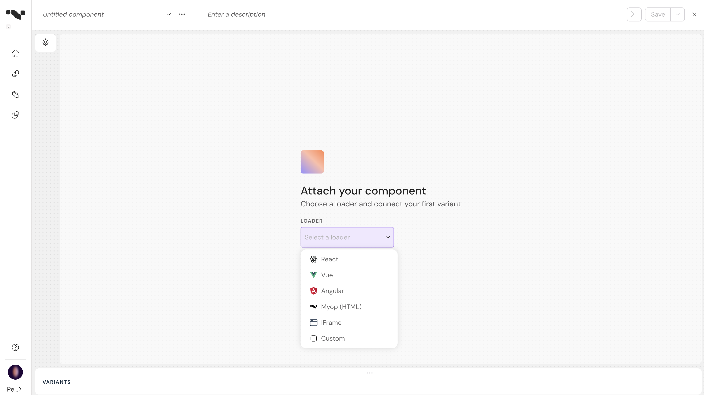
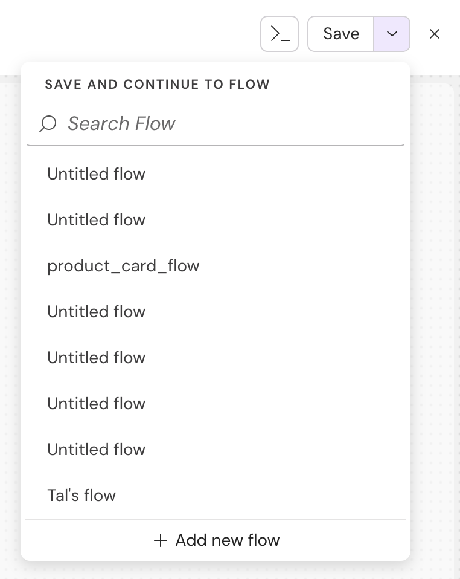
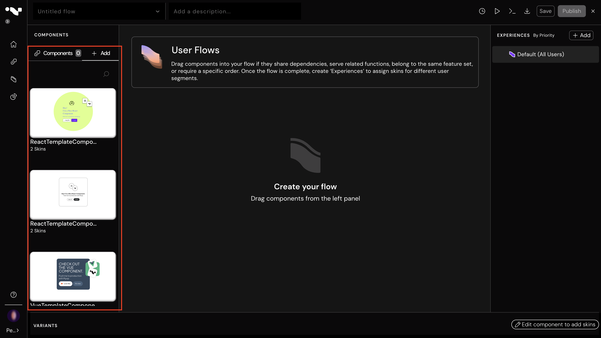

# Myop React Integration Guide

## Overview

This guide explains how to integrate your React components with Myop, allowing you to expose them as web components and incorporate them into Myop flows.

## Table of Contents

- [Exposing React Components](#exposing-react-components)
- [Creating Myop WebComponents](#creating-myop-webcomponents)
- [Creating Flows](#creating-flows)
- [Using Myop Components in React](#using-myop-components-in-react)
- [Communication with React Components](#communication-with-react-components)

## Exposing React Components

Use the `expose` function to directly expose your React component:

```typescript
import { App } from './app';
import { expose } from '@myop/react-remote';

expose(App, 'test-comp-1');
```

## Creating Myop WebComponents

Follow these steps to create a Myop WebComponent from your react component:

1. Open the Myop dashboard at [https://dashboard.myop.dev](https://dashboard.myop.dev) <br>
   <br>

2. To create a new component using a predefined template, click on the "Use sample component" button.
3. To create a new component from scratch, click on the "Create from scratch" button.
4. Choose React loader type <br>
   <br>

5. Define how this component connects to your host app using props and refs. <br/>
6. If you're using a template, you can add all detected refs. Otherwise, add your own refs / props from the configuration panel.
<br>
<br>


6. Configure your component:
   - Enter the component name and description.
   - Enter your component URL (e.g., http://localhost:4400/main.js).
   - Enter the tag name that you exposed the component with.
   - Click on the "view source code" button to view the React code example .
   - Click on the "Set to default" to set the relevant variant as the default one. 
   - Click on the Delete button to delete a variant. <br/>
     <br>


**Note:** The GUID in the browser URL is the `componentId` that you'll need later

7. Saving:
   - If you want to save the component, click on the "Save" button
   - If you want to attach the component to an existing "Flow", Click on the ChevronDown button to search for the relevant flow
   - If you want to attach the component to a new flow, click on the (after the component itself was already saved) <br/>
     <br>

8. The component is saved and published! You can copy the code snippet and add this to your host application. <br/>
<br>


## Creating Flows

1. Open the Myop dashboard at [https://dashboard.myop.dev](https://dashboard.myop.dev)
   <br>

2. Click on the "Create a new flow" button to add a new flow

3. Add your component to the flow <br/>
<br>


4. Note: The GUID in the browser URL is the `flowId` that you'll need later

## Using Myop Components in react

You can integrate Myop components into your react application like so:

```tsx

import {MyopContainer} from "@myop/react";

export const Component = ()=> {
    return <MyopContainer
               componentId={'8c72d29b-c8a0-41cf-b08f-4acca96c7a16'}
               flowId={'49283058-a787-4fa5-b0d2-516b2e6dc5e3'} />;
}
```

## Communication with React Components

The `MyopContainer` component accepts any `props` that are passed down to the component, which can include a wide variety of data types. This may consist of simple primitive values, complex objects, functions, and even non-serializable objects.

The `MyopContainer` component also provides a `componentReady` event that you can use to communicate with your react component.

```tsx
<MyopContainer
        componentId={'8c72d29b-c8a0-41cf-b08f-4acca96c7a16'}
        flowId={'49283058-a787-4fa5-b0d2-516b2e6dc5e3'}
        someProp1="123"
        someProp2="456"
        onReady={(myopComponent)=>{}}
/>
```

## Additional Resources

- For more information on the Myop platform, visit [https://myop.dev/](https://myop.dev/)
- For API documentation, refer to [https://docs.myop.dev/](https://docs.myop.dev/)
